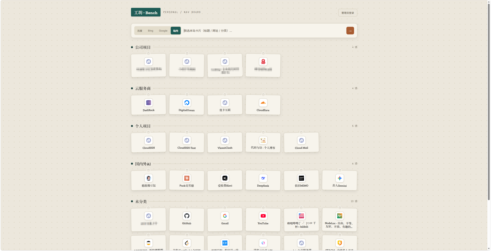

<div align="center">
  
  <p>一个基于 Cloudflare Workers 的 Serverless 个人导航页：分类卡片、书签导入导出、站内筛选与管理员后台。</p>
  <p><b>极致轻量 · 一键部署 · 钉板工坊 UI</b></p>
  <p>
    <a href="https://github.com/newbietan/PegNav/stargazers"></a>
    <a href="LICENSE"></a>
    
    
    
    
    
  </p>
  <p>
    <a href="#highlights">核心优势</a> ·
    <a href="#features">功能特性</a> ·
    <a href="#quick-start">部署指南</a> ·
    <a href="#architecture">架构设计</a> ·
    <a href="#api">API</a> ·
    <a href="#faq">常见问题</a> ·
    <a href="#license">开源协议</a>
  </p>
</div>

> [!TIP]
> **PegNav** 把导航页做成单一 Cloudflare Worker：静态前端 + Hono API + D1 存储。连接 GitHub 即可自动构建部署，D1 可自动开通，表结构在首次访问时自动初始化。

## 效果演示

> 暖色钉板（pegboard）风格：分类分区、网站卡片、搜索栏与管理弹窗。公开只读；登录后可增删改、拖拽排序、导入导出。

<div align="center">
  
  <p><sub>部署完成后打开 <code>*.workers.dev</code> 即可体验完整界面</sub></p>
</div>

## 目录

- [核心优势](#highlights)
- [核心特性](#features)
- [架构说明](#architecture)
- [快速部署](#quick-start)
  - [GitHub 绑定自动部署](#方式一通过-github-绑定自动部署推荐)
  - [部署检查清单](#部署检查清单)
  - [设置管理密码](#设置管理密码)
  - [确认 D1 绑定](#确认-d1-绑定)
- [日常使用](#usage)
- [API 一览](#api)
- [开发说明](#development)
  - [目录结构](#目录结构)
  - [技术栈](#技术栈)
  - [本地构建](#本地构建可选)
- [常见问题](#faq)
- [路线图](#roadmap)
- [开源协议](#license)

<a id="highlights"></a>
## 核心优势

### 极致 Serverless

- **零服务器成本**：Cloudflare Workers + D1 + Assets，无需自建 VPS。
- **边缘加速**：静态资源与 API 同域部署，全球边缘节点分发。
- **自动开通 D1**：`wrangler.toml` 不写死 `database_id`，部署时 Automatic provisioning 创建并绑定（Beta）。

### 开箱即用

- **GitHub 一键部署**：控制台 Import 仓库 → `npm run build` → 自动 `wrangler deploy`。
- **运行时建表**：首次访问 `/api/*` 自动 `CREATE TABLE`；空库写入示例数据。
- **现代化前端**：Vite + TypeScript，无 UI 框架依赖，产物小、加载快。

### 安全可靠

- **短期 HMAC Token**：登录签发 7 天会话 token，前端不再长期存明文密码。
- **登录限流**：按 IP 统计失败次数，15 分钟窗口内超限返回 429。
- **安全响应头**：CSP、`X-Frame-Options`、`nosniff`、`Referrer-Policy` 等。
- **URL 校验**：前后端统一规范化，拒绝危险协议与非法域名。

<a id="features"></a>
## 核心特性

- **分类 + 链接卡片**：钉板视觉、favicon（Google 优先 + Worker 代理兜底，支持 data URI）。
- **管理员后台**：新建 / 重命名 / 删除分类；添加 / 编辑 / 删除链接。
- **拖拽排序**：管理态拖分类把手或卡片，顺序写入 `sort_order`。
- **站内筛选**：搜索栏「站内」模式按标题 / URL / 域名 / 分类名过滤；`/` 快捷聚焦。
- **外站搜索**：百度 / Bing / Google 一键跳转。
- **书签导入**：支持 Chrome / Edge / Firefox 导出的 Netscape HTML；合并或整库替换。
- **书签导出**：HTML（可再导入）或 JSON 备份。
- **多端适配**：手机 / 平板 / 桌面响应式；触控设备管理按钮常显。
- **加载体验**：首屏骨架屏、失败可重试、toast 提示。

<a id="architecture"></a>
## 架构说明

```text
浏览器
  │  GET /              → Worker Assets（Vite 构建产物）
  │  /api/*             → Hono 路由
  ▼
Cloudflare Worker
  ├── Hono API
  │     ├── /api/data、login、categories、links
  │     ├── /api/reorder、import、favicon
  │     └── 安全头 / 限流 / Token 鉴权
  ├── Assets binding    → dist/client
  └── D1 binding (DB)   → categories / links
```

| 层 | 技术 | 说明 |
|----|------|------|
| 前端 | Vite + TypeScript | `src/client`，无 UI 框架 |
| API | Hono | `src/worker` |
| 数据 | Cloudflare D1 | 自动开通 + 运行时 schema |
| 静态资源 | Worker Assets | `not_found_handling = single-page-application` |
| 鉴权 | HMAC Token | Bearer；兼容过渡期明文密码 |
| 部署 | Dashboard ↔ GitHub | 推送 `main` 自动构建 |

<a id="quick-start"></a>
## 快速部署

### 方式一：通过 GitHub 绑定自动部署（推荐）

1. Fork 或使用本仓库：[`newbietan/PegNav`](https://github.com/newbietan/PegNav)，确保 `main` 为最新。
2. 打开 [Cloudflare Dashboard](https://dash.cloudflare.com/) → **Workers & Pages** → **Create**。
3. 选择 **Import a repository**，授权 GitHub 并选中本仓库，分支 `main`。
4. 构建设置建议：

| 配置项 | 建议值 |
|--------|--------|
| 构建命令 | `npm run build` |
| 部署命令 | 默认 `npx wrangler deploy`（一般不用改） |
| 根目录 | `/` |

5. 保存并触发首次部署。

> [!NOTE]
> `wrangler.toml` **不包含** `database_id`。部署时走 Cloudflare **Automatic provisioning**，自动创建 D1 并绑定到变量名 **`DB`**。

### 设置管理密码

1. 进入该 Worker → **Settings → Variables and Secrets**。
2. **Add** → 类型 **Secret**。
3. Name：`ADMIN_PASSWORD`，Value：你的管理密码。
4. 保存；若提示，再点一次 **Deploy / Retry**。

> 密码不要写进代码或 GitHub。Secret 只能在控制台配置。

### 确认 D1 绑定

Worker → **Settings → Bindings** 应有：

- **D1**：Variable name = **`DB`**

若首次部署后没有：

- **Retry deployment**；或  
- 手动添加 D1（绑定名必须是 `DB`），再部署。

### 打开站点

使用 Worker 的 `*.workers.dev`（或自定义域名）。  
首次打开会请求 `/api/data`：自动建表；若库为空，写入示例分类 / 链接。

之后：`git push origin main` → Cloudflare 自动构建部署。

### 部署检查清单

- [ ] GitHub `main` 已最新  
- [ ] Worker 已连接仓库，构建命令 `npm run build`  
- [ ] Bindings 中有 D1 → `DB`  
- [ ] Secret `ADMIN_PASSWORD` 已设置  
- [ ] 打开站点能看到数据；能登录管理  

### 自动 vs 手动

| 步骤 | 是否自动 |
|------|----------|
| 创建 D1 数据库 | ✅ 部署时自动开通（需账号支持 Automatic provisioning） |
| 绑定到 Worker（`DB`） | ✅ 同上 |
| 建表 + 空库示例数据 | ✅ 首次 `/api/*`（`src/worker/schema.ts`） |
| 设置 `ADMIN_PASSWORD` | ❌ 控制台 Secret |
| 连接 GitHub / 点创建 | ❌ 控制台一次性操作 |

若自动开通不可用，在控制台手动建 D1，绑定名填 **`DB`** 即可，**不必**把 `database_id` 写回仓库。

<a id="usage"></a>
## 日常使用

| 操作 | 说明 |
|------|------|
| 浏览 | 默认只读，点击卡片打开网站 |
| 登录 | 右上角「管理员登录」，密码为 `ADMIN_PASSWORD` |
| 会话 | 浏览器保存短期 `admin_token`（非明文密码），约 7 天有效 |
| 站内筛选 | 搜索栏选「站内」，输入关键词；快捷键 `/` 聚焦 |
| 外站搜索 | 切换百度 / Bing / Google 后回车或点 → |
| 排序 | 管理态：分类左侧 `⋮⋮` 拖分类，卡片可拖拽；筛选中禁用排序 |
| 导入 | 「导入书签」上传 `favorites_*.html`，合并或替换 |
| 导出 | 「导出」选择 `html` 或 `json` |
| 退出 | 「退出管理」清除本地 token |

<a id="api"></a>
## API 一览

| 方法 | 路径 | 鉴权 | 说明 |
|------|------|------|------|
| GET | `/api/data` | 否 | 全量分类与链接 |
| POST | `/api/login` | 否 | 校验密码，返回 `{ token, expires_at }` |
| GET | `/api/login/me` | Bearer | 校验会话 |
| POST | `/api/categories` | Bearer | 新建分类 |
| PUT | `/api/categories/:id` | Bearer | 重命名分类 |
| DELETE | `/api/categories/:id` | Bearer | 删除分类 |
| POST | `/api/links` | Bearer | 新建链接 |
| PUT | `/api/links/:id` | Bearer | 编辑链接 |
| DELETE | `/api/links/:id` | Bearer | 删除链接 |
| PUT | `/api/reorder` | Bearer | 批量更新分类 / 链接顺序 |
| POST | `/api/import` | Bearer | 批量导入（`merge` / `replace`） |
| GET | `/api/favicon` | 否 | 图标代理（`?url=`） |

鉴权头：

```http
Authorization: Bearer <session_token>
```

登录成功后使用返回的 `token`。服务端仍兼容过渡期「Bearer 明文密码」，客户端已改为只存 token。

<a id="development"></a>
## 开发说明

### 目录结构

```text
PegNav/
├── src/
│   ├── client/              # 前端（Vite root）
│   │   ├── public/          # favicon 等静态资源
│   │   ├── main.ts          # 入口与交互
│   │   ├── render.ts        # 渲染 / 筛选 / 拖拽
│   │   ├── api.ts           # API 封装
│   │   ├── auth.ts          # token 存储与管理态 UI
│   │   ├── bookmark-import.ts
│   │   ├── export.ts
│   │   └── styles.css
│   ├── worker/              # Hono Worker
│   │   ├── index.ts         # 入口、安全头、路由
│   │   ├── auth.ts / token.ts / rate-limit.ts / schema.ts
│   │   └── routes/          # data login categories links import reorder favicon
│   └── shared/
│       └── url.ts           # URL 规范化（前后端共用）
├── wrangler.toml            # Worker / D1 / Assets
├── vite.config.ts
├── package.json
├── assets/
│   ├── logo.svg             # README 标识
│   └── demo.png             # 效果演示截图
└── LICENSE
```

### 技术栈

| 层 | 技术 |
|----|------|
| 前端 | Vite 6 · TypeScript · 原生 DOM |
| API | Hono · Cloudflare Workers |
| 数据 | Cloudflare D1 |
| 图标 | Google s2 + `/api/favicon` 边缘缓存 |
| 部署 | Cloudflare Dashboard ↔ GitHub |

### 本地构建（可选）

项目推荐 **仅控制台部署**。若需本地校验：

```bash
npm install
npm run typecheck
npm run build
```

产物输出到 `dist/client`，由 `wrangler.toml` 的 `[assets]` 托管。

<a id="faq"></a>
## 常见问题

**接口 503 / 数据库未就绪**  
→ D1 未绑定或绑定未生效：检查 Bindings 是否有 `DB`，然后重新部署。

**登录失败 / 提示登录已过期**  
→ 确认 Secret 名为 `ADMIN_PASSWORD`；改密码后需重新登录拿新 token；失败过多会被限流 15 分钟。

**构建失败**  
→ 查看 Deployments 日志；需能执行 `npm install` 与 `npm run build`（Node 18+）。

**静态页有、接口 404**  
→ 确认是 **Worker** 部署且 `run_worker_first = ["/api/*"]`，不要用「仅静态 Pages」。

**图标只显示字母**  
→ 强刷缓存；Google 不可达时会走 Worker 代理；个别站点无图标时仍显示首字母兜底。

**拖拽无效**  
→ 需管理登录；站内筛选开启时会禁用排序，清空关键词后再拖。

**想清空示例数据**  
→ 管理态删除即可；仅当分类数为 0 时会再次自动 seed。

<a id="roadmap"></a>
## 路线图（可选后续）

- 置顶 / 常用、批量管理  
- 深色模式  
- 单测与 CI（typecheck + build）  
- 图标失败可点重试  

欢迎 Issue / PR。

<a id="license"></a>
## 开源协议

本项目基于 [MIT License](./LICENSE) 开源。

---

<div align="center">
  <sub>Built with Cloudflare Workers · Hono · Vite · TypeScript</sub>
</div>
